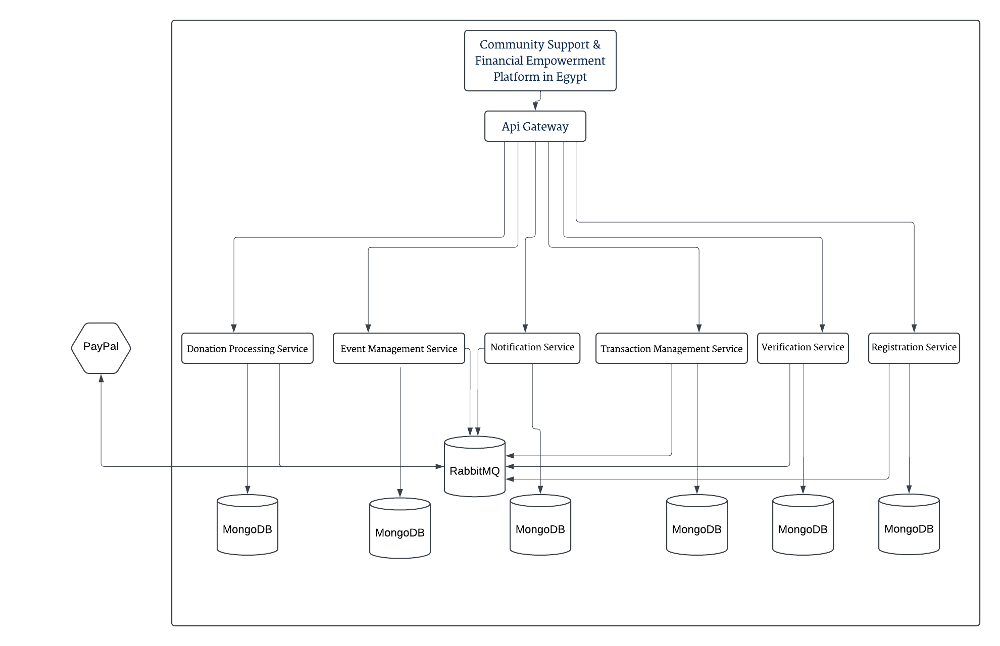

# Community Support & Financial Empowerment Platform

## Overview

The Community Support & Financial Empowerment Platform is an innovative initiative developed by students of the German International University. This platform is designed to bridge the gap between charitable support and sustainable economic independence in Egypt's developing economy. By leveraging modern technology and community engagement, we aim to create a transparent, efficient, and impactful ecosystem that connects donors, beneficiaries, NGOs, and volunteers.

## Vision and Mission

- **Vision:** To create a connected, transparent, and supportive ecosystem where financial assistance and developmental resources empower individuals and communities to achieve long-term economic stability.
  
- **Mission:** To harness innovation to build trust, streamline continuous aid distribution, and promote growth, self-reliance, and cohesive community among Egyptians.

## Key Objectives

- **Empowerment:** Enable low-income individuals to access financial support and resources for sustainable livelihoods.
  
- **Transparency:** Build donor confidence through blockchain technology that tracks and reports on donations, ensuring accountability and reducing corruption.
  
- **Community Engagement:** Foster active participation from community members and local organizations through crowdfunding, feedback systems, and event participation.
  
- **Scalability and Sustainability:** Partner with businesses and NGOs to expand services and create a self-sustaining model.

## Features

- **User Registration and Verification:** Secure and straightforward registration for donors, beneficiaries, and volunteers, with identity verification against national databases.
  
- **Donation Management:** A user-friendly interface for browsing requests and projects, with a payment portal supporting local banks and mobile payment options (e.g., Fawry, Vodafone Cash).
  
- **Real-Time Tracking:** Donors can track the usage of their funds through a personalized dashboard, receiving updates on beneficiaries' progress and project developments.
  
- **Volunteer Opportunities:** Connects volunteers with NGOs for various initiatives, enhancing community engagement and support.
  
- **Blockchain Transparency:** Ensures all financial transactions and aid distributions are logged and verifiable, building trust among stakeholders.

## Stakeholders

- **Donors:** Individuals and organizations looking to make a positive impact, like Ahmed, who wish to contribute to charitable causes.
  
- **Beneficiaries:** Individuals in need, such as Fatima, who seek support for medical and essential needs.
  
- **NGOs:** Organizations like "Life Makers" that facilitate charitable initiatives and community projects.
  
- **Volunteers:** Individuals like Layla, eager to contribute their time and skills to support community initiatives.

## Class Diagram

[View the class Diagram on Google Drive](https://drive.google.com/file/d/18xSCode3DjBXkPwAqxHUxTsqf4eRa-KO/view)

## Architecture Design

## Use Cases

### Donor Use Case

  

- Registration, browsing projects, making donations, and tracking contributions through a personalized dashboard.

### Beneficiary Use Case

  

- Submitting requests for support, receiving assistance, and tracking the status of their aid.

### NGO Use Case

  

- Managing projects, connecting with donors, facilitating volunteer efforts, and reporting on the impact of their initiatives.

### Volunteer Use Case

- Registering, browsing opportunities, applying for events, and participating in community support efforts.

### Admin Use Case

  

## Importance and Impact

This platform addresses critical gaps in existing charitable efforts in Egypt by promoting a long-term vision for economic empowerment. By supporting micro-investments and enhancing financial literacy, we contribute to workforce development and economic stimulation. The transparent donation tracking builds trust among donors, encouraging more contributions and fostering a culture of giving.

## Contributing

We welcome contributions from the community! If you would like to start building the project contact me on abdelrahmanelnagar123@gmail.com

## License

This project is licensed under the MIT License. See the LICENSE file for more details.

For more information, please refer to the project documentation or contact the team members listed in the project. Thank you for your interest in the Community Support & Financial Empowerment Platform! Together, we can make a difference in the lives of many individuals and communities in Egypt.
